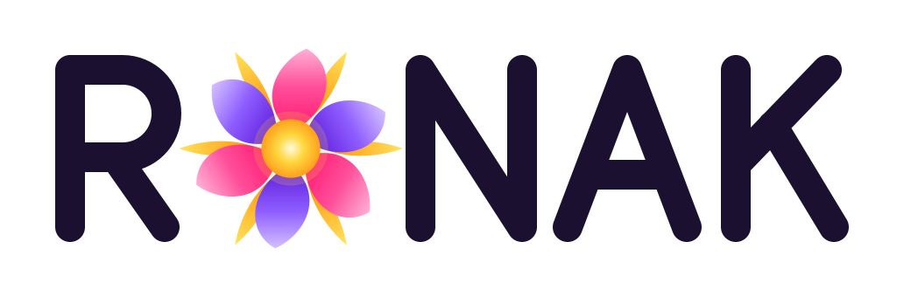

# Ronak — Check in early. Act early.

**A free, private, multilingual mental-wellbeing check-in — built for India, usable
worldwide** — plus the manifesto, evidence register and ethics charter behind it.

**Live site:** https://aryanmanhas12.github.io/Psych/
**Built by:** [Aryan Manhas](https://github.com/aryanmanhas12) · MIT licensed

> If you or someone you know is struggling right now:
> **Anywhere:** [findahelpline.com](https://findahelpline.com) — verified helplines in 130+ countries
> **India:** Tele-MANAS **14416** · KIRAN **1800-599-0019** · Emergency **112** (all free, 24×7)

---

## Why this exists

Mental disorders reach their **peak age of onset at 14.5 years**, and **48% have already
begun before 18** (Solmi et al., *Molecular Psychiatry* 2021 — 192 studies, 708,561
people). About **half of all people** will develop one by age 75 (McGrath et al., *Lancet
Psychiatry* 2023). Yet minimally adequate treatment for depression reaches **23% in
high-income countries and 3% in low-income ones** (Moitra et al., *PLoS Medicine* 2022).

The burden lands earliest on the young and hardest where care is scarcest. India — with
roughly **0.75 psychiatrists per 100,000 people** against a WHO recommendation of 3+ — is
where this project started and where it is most specific, but the arithmetic is global.

This attacks the two ends of the problem a website can actually reach: **finding people
earlier**, and **giving them the follow-up record the system doesn't**.

## What's here

| File | What it is |
|---|---|
| `index.html` + `app.js` + `app.css` | **The app** — instruments, guided conversation, guidance, history, reminders. The page, its script and its styles are separate files so a repeat visit only re-fetches the ~15KB page |
| `site.css` | **Shared design system** — one source of truth for tokens, dark mode, nav and components |
| `i18n.js` | **Translation layer** — every UI string and instrument item in 6 languages |
| `helplines.js` | **Crisis lines worldwide** — directory-first, region tables, review-dated |
| `ethics.html` | **Ethics & Privacy Charter** — every claim written to be independently verifiable |
| `evidence.html` | **The Evidence Register** — peer-reviewed citations behind every design decision |
| `manifesto.html` | **The Waiting Room is Full** — a citizen's manifesto on the treatment gap |
| `poster.html` + `qr-site.svg` | **Printable A4 clinic poster** in six languages, with a decode-tested QR code |
| `sw.js` + `manifest.webmanifest` | **Offline support** — installable app, works with no connection |
| `fonts/` | **Baloo 2** family (Ek Type, OFL) — self-hosted, one file per script, so the site makes zero third-party requests |
| `brand/` | **The logo** — the bloom-sun mark, the RONAK lockup for light and dark grounds, a 1024px icon master |
| `icon.svg`, `icon-*.png`, `og-image.jpg` | App icons, favicon and the social card, all drawn from the same mark |
| `LICENSE` | MIT, plus a not-a-medical-device notice |

Plain HTML/CSS/JS. **No build step, no framework, no backend, no tracking.** Open any
file in a browser or host the folder anywhere static.

## The look: night, then dawn

**Ronak** means radiance — the glow a place takes on when it comes alive. The whole design
is built on that one word.

- **The logo is a bloom-sun.** Six petals, pink and violet, turn around one gold light,
  with gold rays reaching past them. Read it as a sunrise or as a flower opening; both are
  the same idea, something growing towards light. The O of the RONAK wordmark *is* the
  mark. Files in [`brand/`](brand/).
- **The page opens at night and warms as you scroll.** The first screen is a sky before
  dawn with the bloom-sun under the horizon; scrolling lifts it and opens it, and three
  soft glows behind every page breathe at about six breaths a minute. The brights are used
  as *light*, glowing out of the dark, never as flat paint on a white page — research on
  people in distress is consistent that loud, cheerful flat colour feels jarring when your
  own mood is grey. Meet them in the dark, then show them the light.
- **Every check-in has its own place.** The five questionnaires are full-screen scenes
  stacked like a deck, each in its own colour with a small wordless picture of the turn it
  hopes for: a spark lighting, the sun clearing the hills, a tangle loosening into a wave,
  a bud opening, a drop landing in still water. None of them illustrates the problem.
- **Nothing is hijacked.** The scroll moves at your speed (sticky positioning and CSS
  scroll timelines, not scroll-jacking); every animation stops for
  `prefers-reduced-motion`; high contrast turns every glow off; scenes only animate while
  they are on screen, to spare older phones' batteries.
- **The working papers stay quiet.** Evidence, Global, Ethics, Manifesto and Poster are one
  tap away on every page, but smaller and dimmer, after the four things a person came to do.

## Features

**A wordless opening** — Chaplin's principle, that expression crosses every language
border, applied literally: a ten-second silent film carries the whole argument with
**no words at all**. A person curled on the floor of a room at night; the world passing
the window without stopping; a door opening onto light; someone coming in to sit beside
them — beside, not over; the head lifting, the room warming, and the warmth opening into
the bloom-sun, the logo, over the two of them. It reads identically to a Tamil speaker, a
Bengali speaker, or someone who cannot read at all — which matters, because low literacy
and untreated mental illness overlap in exactly the populations this serves. It plays once
per device, never for `prefers-reduced-motion` users, never on a deep link (someone
arriving at `#resources` wants a phone number, not a film), keeps the crisis strip live
above it, and Skip is the first focusable element.

**A printable poster for the wall** — `poster.html` renders a single A4 sheet in any of the
six languages, with a QR code to the site. It is the bridge between "this exists" and
"someone actually opens it": print it, pin it in a waiting room, a college corridor, a PHC.
The QR was generated with a reference encoder and **decode-tested straight out of the
printed PDF** at 150 dpi, and every language is verified to fit exactly one page.

**Four validated instruments** — PHQ-4 (quick triage), PHQ-9 (depression), GAD-7
(anxiety), AUDIT-C (alcohol use), all public-domain and scored with published cutoffs.

**Six languages** — English, हिन्दी, मराठी, বাংলা, தமிழ், తెలుగు (roughly 70% of India by
first language). The choice persists between visits.

**A safety net** — any non-zero answer on the PHQ-9 self-harm item immediately surfaces a
crisis panel before the score is even discussed. Crisis lines are pinned on every page in
every language.

**Guidance, not just a number** — severity-matched next steps written for Indian care
pathways (PHC, District Mental Health Programme, Tele-MANAS), plus a "get care, not just
a refill" checklist of questions to ask the doctor.

**Follow-up built in** — scores saved privately on-device, charted over time against the
clinical cutoff, exportable/importable as JSON, printable as a doctor summary, and a
downloadable `.ics` reminder for the next re-screen (1–4 weeks by severity). Plus a daily
one-tap mood check-in with a 14-day strip and streak.

**Accessible by design** — text-size and high-contrast controls, full keyboard operation
(number keys and arrow keys answer questions), ARIA radiogroups and live regions, focus
management on view changes, a skip link, 44px+ touch targets, `prefers-reduced-motion`
support, and semantic tables.

**A guided conversation, not a chatbot** — "Talk it through" walks someone from *"I don't
know where to start"* to the right screener, the right helpline, or concrete advice on
supporting someone else. It runs a fixed script rather than a language model: it cannot
improvise clinical advice or miss a crisis signal in free text, and a permanent "I need
help now" button means escalation never depends on parsing what someone typed.

**Crisis lines worldwide** — maintained international directories (Find A Helpline, IASP,
Befrienders) are always shown first because they never go stale, with region-by-region
numbers beneath them, emergency numbers by country, and a visible review date.

**Works offline, installs like an app** — a service worker caches the whole site, so it
keeps working with no connection at all: screeners, guidance and every helpline number
stay available on a patchy network. On Android and desktop the browser offers an
**Install** button; it then runs full-screen from the home screen. The cache holds only
the site's own static files, never your answers.

**Dark mode and theme control** — auto (follows your device), light, or dark. People in
distress use their phones at 2am; a wall of white light is a usability problem, not a
preference. Helpline links are contrast-checked in both themes (5.98:1 light, 6.60:1 dark
— both above the WCAG AA threshold).

**A grounding exercise** — paced breathing at roughly six breaths a minute (4s in, 4s
hold, 6s out), the rate that engages the body's calming response. Offered on the crisis
path *after* the helplines and never instead of them, with the numbers still on screen
throughout. It degrades to text cues under `prefers-reduced-motion`.

**Private by architecture** — everything runs in the browser. There is no server, no
account, and no analytics; answers are stored only in `localStorage` on the user's own
device, and the user can export or delete all of it at any time. Fonts are self-hosted, so
the site makes **zero third-party requests** — the privacy claim is literally true and
checkable in DevTools. See [`ethics.html`](ethics.html).

### What it is not

A **screening and education tool, not a diagnostic instrument**. A high score means "talk
to a professional," never "you have X." It does not replace clinical assessment.

## Editing it

Everything is plain text — edit on GitHub in the browser (open a file → pencil icon →
commit) or clone and edit locally. Changes to `main` go live on GitHub Pages in ~1 minute.

| To change… | Edit |
|---|---|
| Wording, questions, guidance, resources | `i18n.js` — find the language block, edit the string |
| Add a language | Copy any language block in `i18n.js`, translate the values, keep the keys |
| Add an instrument | Add scoring to `META` in `app.js`, then add its text to every language in `i18n.*.js` |
| Ship a release | Bump `REL` in `sw.js` **and** the `?v=` on every page's `site.css`, `nav.js`, `app.css`, `app.js` links |
| Colours, spacing, layout | `site.css` — change a token, every page follows |
| The logo | `brand/` — then re-render `icon-*.png` and `og-image.jpg` from it |
| Citations | `evidence.html` |
| Helpline numbers | `helplines.js` — read the safety note at the top first |
| Ethics or privacy claims | `ethics.html` — only claim what the code actually does |

Run it locally with any static server, e.g. `python3 -m http.server`, then open
`http://localhost:8000`.

## Roadmap

- Professionally validated translations for the instruments (published Hindi/Malayalam
  validations exist and should replace the working translations)
- More instruments: perceived stress (PSS-4), postpartum (EPDS), adolescent screeners
- Caregiver mode for ASHA / community health workers doing assisted screening
- Field feedback from a DMHP clinic or college counselling centre
- A custom domain, and a Play Store listing via Bubblewrap once a clinician has reviewed it

## Credits & licences

Code © 2026 Aryan Manhas, MIT licensed. PHQ-4, PHQ-9 and GAD-7 were developed by Drs.
Kroenke, Spitzer, Williams and colleagues and are free to use without permission; AUDIT-C
derives from the WHO AUDIT. Statistics cited come from the National Mental Health Survey
of India 2015–16 and the published literature indexed in `evidence.html`. Indian-language
instrument items here are working translations for accessibility, not the officially
validated language versions.
